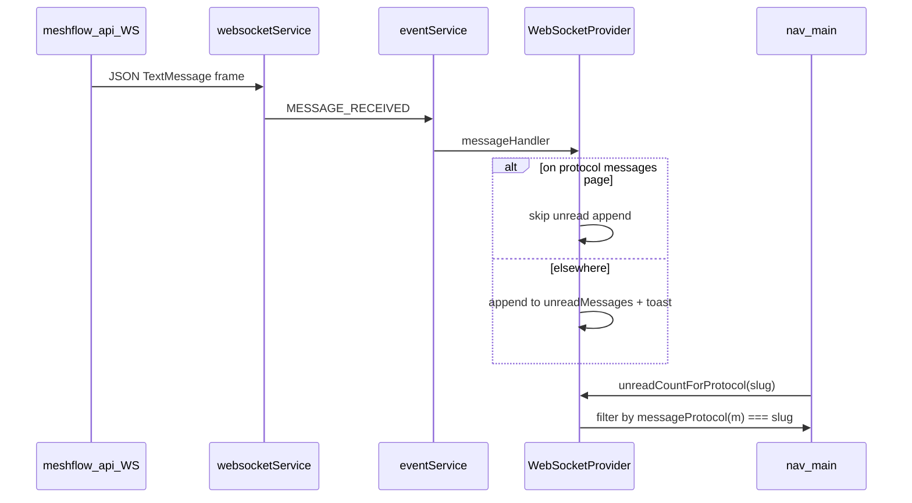

# Messages UI — unread count

**Purpose:** How sidebar **Messages** badges and mark-as-read behave today, and why MeshCore traffic can inflate the Meshtastic badge ([#279](https://github.com/pskillen/meshflow-ui/issues/279)).

**API counterpart:** [meshflow-api `docs/features/text-messages/unread-count.md`](https://github.com/pskillen/meshflow-api/blob/main/docs/features/text-messages/unread-count.md)

**Broader UI context:** [architecture.md](../../messages/architecture.md) (WebSocket section), [gaps-and-roadmap.md](../../messages/gaps-and-roadmap.md).

---

## Product behaviour (intended)

| Rule                                | Behaviour                                                                      |
| ----------------------------------- | ------------------------------------------------------------------------------ |
| MT nav badge (`/messages`)          | Count of unread **Meshtastic** messages only                                   |
| MC nav badge (`/meshcore/messages`) | Count of unread **MeshCore** messages only                                     |
| User on MT messages page            | Do not increment MT unread; clear MT unread when route is `/messages`          |
| User on MC messages page            | Do not increment MC unread; clear MC unread when route is `/meshcore/messages` |
| User clicks Messages in nav         | `markAsReadForProtocol(that protocol)` then navigate                           |
| Persistence                         | None — refresh clears all unread                                               |

Unread means: **arrived via WebSocket while not on that protocol’s messages URL**, until cleared. It is not “messages since last login” from the server.

---

## Code anchors

| Piece                         | Path                                                                                              |
| ----------------------------- | ------------------------------------------------------------------------------------------------- |
| Unread state + helpers        | `src/providers/WebSocketProvider.tsx`                                                             |
| Protocol derivation           | `src/lib/message-protocol.ts` — `messageProtocol`, `isOnMessagesPage`, `messagesRouteForProtocol` |
| Nav badges + click clear      | `src/components/nav-main.tsx` — `messagesProtocolForUrl`, `NavMenuItems`                          |
| WS connect + parse            | `src/lib/websocket/websocketService.ts` — `ws…/ws/messages/?token=…`                              |
| On-page realtime (not unread) | `src/hooks/useMessagesWithWebSocket.ts`                                                           |
| Tests                         | `src/components/nav-main.test.tsx` (mocks WS; no unread assertions yet)                           |

---

## Data flow



### `WebSocketProvider` (session state)

- State: `unreadMessages: TextMessage[]` (flat list, all protocols).
- **Increment:** `messageHandler` — if `!isOnMessagesPage(pathnameRef.current, messageProtocol(message))`, append message and show toast (sender label + body).
- **Clear one protocol:** `markAsReadForProtocol(protocol)` → `filter` out where `messageProtocol(m) === protocol`.
- **Clear all:** `markAllAsRead()` (exposed; nav does not use it).
- **Route effect:** on `location.pathname`, if `isOnMessagesPage(pathname, 'meshtastic'|'meshcore')`, call `markAsReadForProtocol` for that slug.

Helpers:

```ts
unreadCountForProtocol(p) => unreadMessages.filter((m) => messageProtocol(m) === p).length
hasUnreadForProtocol(p) => unreadMessages.some((m) => messageProtocol(m) === p)
hasUnreadMessages => unreadMessages.length > 0  // global; nav uses per-protocol helpers
```

### `messageProtocol(msg)`

| Input `msg.protocol`          | Result           |
| ----------------------------- | ---------------- |
| `'meshcore'`, `2`, `'mc'`     | `meshcore`       |
| anything else / **undefined** | **`meshtastic`** |

REST list responses include `protocol`; **WebSocket frames from the API today do not** (see API doc). That makes `messageProtocol` classify almost all live pushes as Meshtastic — the [#279](https://github.com/pskillen/meshflow-ui/issues/279) symptom.

### Navigation (`nav-main.tsx`)

- `messagesProtocolForUrl('/messages')` → `'meshtastic'`; `'/meshcore/messages'` → `'meshcore'`.
- Badge: red circle, count capped display `9+`, shown when `hasUnreadForProtocol(messagesProtocol)`.
- Link `onClick`: `preventDefault`, `markAsReadForProtocol(protocol)`, `navigate(url)`.

No other components use unread badges today (grep: only `nav-main` + provider).

### `useMessagesWithWebSocket` (same WS event, different path)

Subscribes to `MESSAGE_RECEIVED` independently of unread:

- Drops message if `options.protocol` set and `messageProtocol(message) !== options.protocol`.
- Prepends only when `message.channel === options.channelId` (constellation not checked on WS).

So MC messages on the MC page may also fail to appear live until API sends `protocol` on WS (same classification issue).

---

## Configuration

- WS base URL: `config.apis.meshBot.baseUrl` (Meshflow API origin), path `/ws/messages/`, auth `?token={accessToken}`.
- Reconnect: exponential backoff, max 5 attempts; reconnect on token refresh.

---

## Known gaps / fix direction

| Gap                                                        | Notes                                                                                              |
| ---------------------------------------------------------- | -------------------------------------------------------------------------------------------------- |
| [#279](https://github.com/pskillen/meshflow-ui/issues/279) | Fix API `TextMessageWSSerializer` to include `protocol`; optionally add UI test with MC WS fixture |
| Toasts                                                     | Fire for every unread append even when badge is wrong protocol                                     |
| No message `id` dedup                                      | Duplicate WS deliveries could double-count                                                         |
| `hasUnreadMessages`                                        | Global flag unused by nav; could confuse future features                                           |
| Channel-level unread                                       | Requested for [#281](https://github.com/pskillen/meshflow-ui/issues/281) / roadmap                 |
| `localStorage`                                             | Not used — unread lost on reload                                                                   |

**Minimal fix:** API adds `protocol` to WS JSON; UI unchanged. **Hardening:** unit test `messageProtocol` + provider filter with MC payload; nav test with mocked counts per protocol.

---

## Acceptance criteria mapping ([#279](https://github.com/pskillen/meshflow-ui/issues/279))

| Criterion                 | Current code                           | Blocker                                                           |
| ------------------------- | -------------------------------------- | ----------------------------------------------------------------- |
| MT badge = MT only        | `unreadCountForProtocol('meshtastic')` | WS missing `protocol` → MC counted as MT                          |
| MC badge = MC only        | `unreadCountForProtocol('meshcore')`   | MC unread rarely increments; MT badge inflated                    |
| Mark-as-read per protocol | `markAsReadForProtocol` + route effect | Clearing MC works; MC items stuck in array if misclassified as MT |

---

## Related

- [README.md](README.md) — messages feature hub
- [meshflow-api unread-count.md](https://github.com/pskillen/meshflow-api/blob/main/docs/features/text-messages/unread-count.md) — WS serializer, signal, Redis group
- [#341](https://github.com/pskillen/meshflow-api/issues/341) — parent epic (full messages UI rework)
