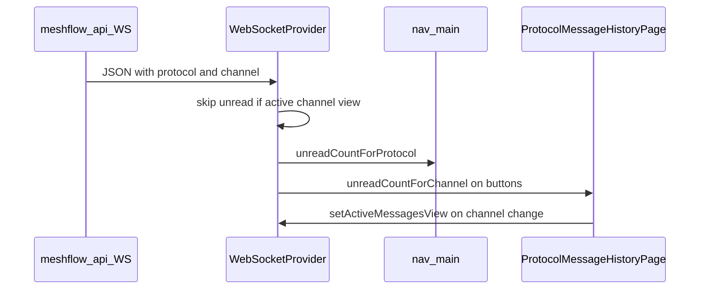

# Messages UI — unread count

**Purpose:** Sidebar **Messages** badges (per protocol), per-channel badges on the messages page, and mark-as-read behaviour.

**API counterpart:** [meshflow-api `docs/features/text-messages/unread-count.md`](https://github.com/pskillen/meshflow-api/blob/main/docs/features/text-messages/unread-count.md)

**Broader UI context:** [architecture.md](../../messages/architecture.md), [gaps-and-roadmap.md](../../messages/gaps-and-roadmap.md).

**Tracking:** Fixed in [#279](https://github.com/pskillen/meshflow-ui/issues/279). Deferred rollup: [meshflow-api#396](https://github.com/pskillen/meshflow-api/issues/396).

---

## Product behaviour

| Surface                            | Count                                | Clear when                                       |
| ---------------------------------- | ------------------------------------ | ------------------------------------------------ |
| Sidebar Messages link (MT / MC)    | All unread for that **protocol**     | Nav click: `markAsReadForProtocol`               |
| Channel button row (messages page) | Unread for **protocol + channel id** | User clicks channel (`markAsReadForChannel`)     |
| Active channel while on page       | No unread increment                  | `setActiveMessagesView({ protocol, channelId })` |

Unread is **in-memory only** (lost on refresh). Not synced to the API.

**Toast:** protocol-level only — fires when the user is **not** on that protocol’s messages route (`/messages` or `/meshcore/messages`). Sibling channels on the same page do not toast; unread badges still increment. Toast visibility in production has been unreliable; verify manually after deploy.

**Channel picker:** button row (same styling as constellation buttons), interim until [#281](https://github.com/pskillen/meshflow-ui/issues/281) / epic [#341](https://github.com/pskillen/meshflow-api/issues/341).

---

## Code anchors

| Piece                          | Path                                                |
| ------------------------------ | --------------------------------------------------- |
| Unread state + helpers         | `src/providers/WebSocketProvider.tsx`               |
| Messages page + channel badges | `src/pages/protocol/ProtocolMessageHistoryPage.tsx` |
| Protocol derivation            | `src/lib/message-protocol.ts`                       |
| Nav badges                     | `src/components/nav-main.tsx`                       |
| WS client                      | `src/lib/websocket/websocketService.ts`             |
| On-page realtime               | `src/hooks/useMessagesWithWebSocket.ts`             |
| Tests                          | `src/providers/WebSocketProvider.test.tsx`          |

---

## Data flow

### `WebSocketProvider`

- `unreadMessages: TextMessage[]` — deduped by `message.id` on append.
- `activeMessagesViewRef` — set by messages page; cleared on unmount or when leaving messages routes.
- **Increment:** unless viewing that protocol’s messages page **and** the message’s `channel` matches the active view.
- **Toast:** only when `!isOnMessagesPage(pathname, proto)` (other protocol still toasts while on messages page).
- **Removed:** pathname effect that cleared entire protocol on entering messages pages.

Helpers: `unreadCountForProtocol`, `hasUnreadForProtocol`, `unreadCountForChannel`, `hasUnreadForChannel`, `markAsReadForProtocol`, `markAsReadForChannel`, `setActiveMessagesView`.

### `ProtocolMessageHistoryPage`

- Registers `setActiveMessagesView` when `selectedChannel` changes.
- Channel buttons call `markAsReadForChannel` on user click (not on auto-select; see #396).

---

## Known gaps

| Gap                                                                     | Notes                                                                                                             |
| ----------------------------------------------------------------------- | ----------------------------------------------------------------------------------------------------------------- |
| [meshflow-api#396](https://github.com/pskillen/meshflow-api/issues/396) | Per-channel badges only for **active constellation**; constellation-level rollup; auto-select mark-as-read nuance |
| Toast reliability                                                       | May not appear in practice — verify; log separate issue if dead                                                   |
| `localStorage`                                                          | Unread not persisted across reload                                                                                |
| `hasUnreadMessages` / `markAllAsRead`                                   | Exposed but unused by nav                                                                                         |

---

## Related

- [README.md](README.md) — messages feature hub
- [meshflow-api unread-count.md](https://github.com/pskillen/meshflow-api/blob/main/docs/features/text-messages/unread-count.md)
