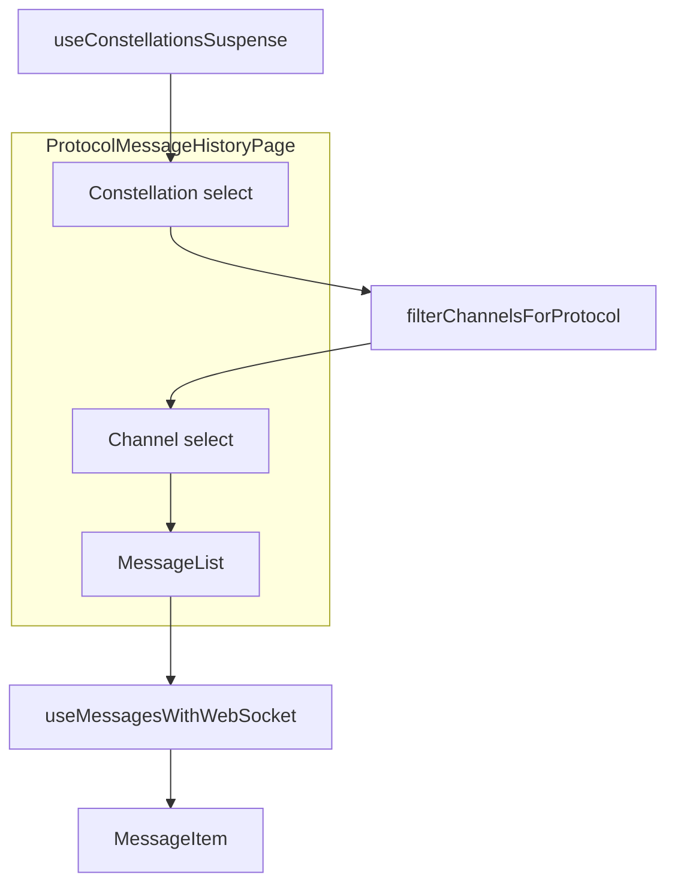

# Messages UI — architecture

## Routes and entry points

| Route                | Page component                                    | Protocol config                          |
| -------------------- | ------------------------------------------------- | ---------------------------------------- |
| `/messages`          | `MessageHistory` → `ProtocolMessageHistoryPage`   | `MESHTASTIC_CONFIG` (`slug: meshtastic`) |
| `/meshcore/messages` | `MeshCoreMessages` → `ProtocolMessageHistoryPage` | `MESHCORE_CONFIG` (`slug: meshcore`)     |

Registered in `src/App.tsx`. Protocol labels/titles come from `ProtocolPageConfig.labels.messagesTitle` in `src/lib/mesh-protocol.ts`.

There is **no** per-node message history route in the UI today, though `MessageList` and `useMessages*` accept an optional `nodeId` (maps to API `sender_node_id`).

## Component flow

### `ProtocolMessageHistoryPage`

- Loads **all** constellations (paginated suspense, `page_size` 500).
- State: `selectedConstellation`, `selectedChannel` (both nullable until auto-set).
- **Auto-select:** first constellation when list loads; first channel after constellation change (channel reset to `null` on constellation change).
- Channels: `constellation.channels` passed through `filterChannelsForProtocol(channels, config.slug)`.
- Renders `MessageList` only when both IDs are set; otherwise empty state (“No channels available…”).

### `MessageList`

- Fetches via `useMessagesWithWebSocket` (`pageSize: 25` on history page).
- Client-side processing:
  1. Split **main** vs **reply/emoji** rows (`reply_to_meshtastic_packet_id`, `is_emoji`).
  2. Group **consecutive** main messages from same sender within **15 minutes** (`CONSECUTIVE_THRESHOLD_MINUTES`).
  3. Attach flat **replies** and **emoji reactions** per `packet_id`.
- **Load more:** infinite query `fetchNextPage` when `hasNextPage`.
- API order: `-sent_at` (newest first).

### `MessageItem`

- Card layout (`article` with border): avatar initial, sender, relative time (`StaleReportedTime`), **“N heard”** button → dialog.
- Body: text, emoji badges, indented replies, continuation blocks for grouped sends.

## Libraries

### `message-protocol.ts`

- `messageProtocol(msg)` → `'meshtastic' | 'meshcore'` (string or legacy numeric `1`/`2`).
- `messagesRouteForProtocol`, `isOnMessagesPage` — used for unread clearing and “on page” detection.

### `message-channels.ts`

- `filterChannelsForProtocol`: match `MessageChannel.protocol`; channels with **no** protocol field are treated as **Meshtastic-only** (legacy).
- `formatMessageChannelLabel`: appends `(#mc_channel_idx)` when set.

### Data hooks

| Hook                                  | Role                                                       |
| ------------------------------------- | ---------------------------------------------------------- |
| `useConstellationsSuspense`           | Constellations + nested `channels[]`; refetch 60s          |
| `useMessagesSuspense` / `useMessages` | `GET /messages/text/` infinite query                       |
| `useMessagesWithWebSocket`            | Merges REST pages + WS prepends; updates React Query cache |

Query keys include `protocol`, `channelId`, `constellationId`, `nodeId`, `pageSize`.

## WebSocket and unread

### Connection

- `websocketService` → `ws…/ws/messages/?token=…` (from `config.apis.meshBot.baseUrl`).
- Parses JSON as `TextMessage`, emits `MESSAGE_RECEIVED` on `eventService`.

### `WebSocketProvider`

- Maintains `unreadMessages: TextMessage[]` (session-scoped, in-memory).
- On `MESSAGE_RECEIVED`: if **not** on that protocol’s messages route, append to unread + toast.
- `markAsReadForProtocol(protocol)` — filter out messages for that protocol.
- Visiting `/messages` or `/meshcore/messages` clears unread for that protocol only (`useEffect` on `location.pathname`).

### `useMessagesWithWebSocket` (in-view realtime)

- Subscribes to `MESSAGE_RECEIVED`.
- Filters: `messageProtocol` matches `options.protocol`; `message.channel === options.channelId` (if channel set).
- Prepends to local `realtimeMessages` and patches first page of query cache.
- Does **not** filter by `constellationId` on WS (only REST query uses constellation).

### Navigation badges

- `nav-main.tsx`: Meshtastic and MeshCore **Messages** links show red count badge (`unreadCountForProtocol`, cap `9+`).
- Click handler: `markAsReadForProtocol` then `navigate` (clears badge when opening that protocol’s page).

## TypeScript models (gaps vs API)

`TextMessage` in `src/lib/models.ts` matches API v2 shape (`heard`, `is_emoji`, `reply_to_meshtastic_packet_id`, `protocol`).

`Constellation` in the UI **does not** currently declare `protocol`, though OpenAPI and Django expose `Constellation.protocol` (single protocol per constellation in the data model). Channel rows have `protocol`, `mc_channel_idx`, `mc_channel_type` (optional on `MessageChannel`).

MeshCore channel **admin/sync** UI lives on **Node settings** (`NodeSettings.tsx`), not on the messages page.
